# Lab 01 — Basic Azure Network Security

> Status: ✅ **Completed**  
> Region: **Belgium Central**

This lab moves from Azure theory into hands-on cloud networking and security.

The objective is to build a small segmented Azure network, validate private connectivity, deliberately break SSH access with a Network Security Group rule, troubleshoot the failure, and restore access using a more precise security policy.

---

## Objectives

- Create an Azure Virtual Network with multiple subnets
- Apply NSGs at subnet level
- Deploy a management VM and a private application VM
- Restrict management access from the internet
- Validate inter-subnet routing
- Use a jump host / SSH ProxyJump
- Create an intentional NSG failure
- Distinguish network failures from authentication failures
- Restore access with least-privilege rules
- Document security, cost, and troubleshooting decisions

---

## Architecture

```text
                         Internet
                            |
                 SSH from my public IP only
                            |
                            v
                    +----------------+
                    | vm-mgmt-001    |
                    | 10.10.10.4     |
                    | Ubuntu 24.04   |
                    +--------+-------+
                             |
                      snet-mgmt
                     10.10.10.0/24
                       nsg-mgmt
                             |
                    Azure VNet routing
                             |
                       nsg-app
                      snet-app
                     10.10.20.0/24
                             |
                    +--------+-------+
                    | vm-app-001     |
                    | 10.10.20.4     |
                    | Ubuntu 24.04   |
                    | No public IP   |
                    +----------------+
```

---

## Addressing Plan

| Resource | Address / CIDR |
|---|---|
| VNet | `10.10.0.0/16` |
| Management subnet | `10.10.10.0/24` |
| Application subnet | `10.10.20.0/24` |
| Management VM | `10.10.10.4` |
| Application VM | `10.10.20.4` |

Azure reserves addresses inside each subnet for platform use, so a /24 does not provide all 256 addresses to workloads.

---

## Azure Resources

| Resource | Name | Notes |
|---|---|---|
| Resource group | `rg-azlab-network-dev` | Lab resources |
| Virtual network | `vnet-azlab-dev-001` | `10.10.0.0/16` |
| Management subnet | `snet-mgmt` | `10.10.10.0/24` |
| Application subnet | `snet-app` | `10.10.20.0/24` |
| Management NSG | `nsg-mgmt` | Associated with `snet-mgmt` |
| Application NSG | `nsg-app` | Associated with `snet-app` |
| Management VM | `vm-mgmt-001` | Ubuntu 24.04, B-series |
| Application VM | `vm-app-001` | Ubuntu 24.04, private-only |

The VMs use subnet-level NSGs. I intentionally avoided adding a second NSG at NIC level so the first lab would have one clear security-policy layer to troubleshoot.

---

## Cost Controls

Cost controls were configured before deploying compute resources.

For the lab I selected low-cost burstable Linux VM sizes and avoided unnecessary premium services.

Operational rules for this lab:

- Use small B-series VMs
- Do not deploy paid DDoS protection just for testing
- Avoid Bastion until its value and cost are specifically being tested
- Deallocate VMs when they are not needed
- Remove orphaned public IPs and disks
- Delete disposable lab resources when testing is complete

No budget screenshot is included because it is operational hygiene rather than technical evidence.

---

# Phase 1 — Network Baseline

The initial VNet was created with two subnets:

```text
vnet-azlab-dev-001
10.10.0.0/16

├── snet-mgmt  10.10.10.0/24
└── snet-app   10.10.20.0/24
```

At the baseline stage there were:

- No custom route tables
- No custom NSG associations
- No application workloads

This created a clean state before security controls were introduced.

### Evidence — VNet and baseline subnets

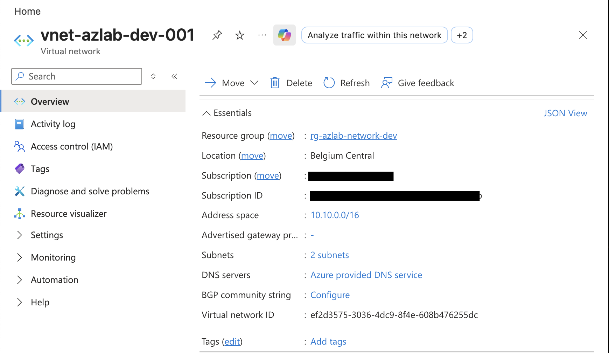

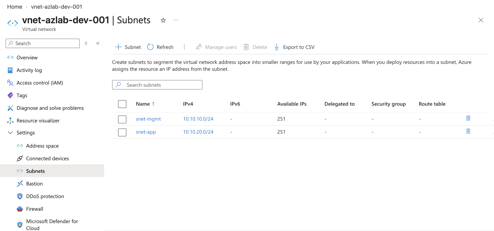

---

# Phase 2 — Subnet-Level NSGs

Two Network Security Groups were created:

```text
nsg-mgmt -> snet-mgmt
nsg-app  -> snet-app
```

Azure default NSG rules include:

### Inbound

| Priority | Rule | Action |
|---:|---|---|
| 65000 | AllowVNetInBound | Allow |
| 65001 | AllowAzureLoadBalancerInBound | Allow |
| 65500 | DenyAllInBound | Deny |

### Outbound

| Priority | Rule | Action |
|---:|---|---|
| 65000 | AllowVNetOutBound | Allow |
| 65001 | AllowInternetOutBound | Allow |
| 65500 | DenyAllOutBound | Deny |

A key lesson is that subnet segmentation by IP addressing does not automatically create security isolation. The default `AllowVNetInBound` rule permits VNet traffic unless a higher-priority custom rule overrides it.

NSGs are stateful, so return traffic for an allowed connection does not require a mirrored allow rule.

### Evidence — NSG association

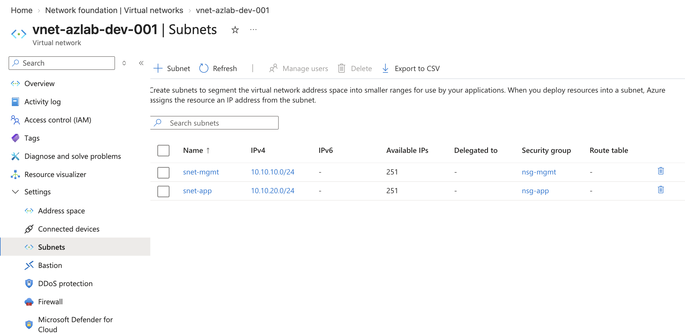

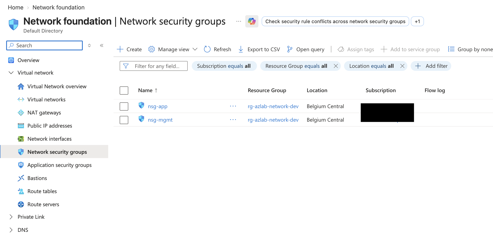

---

# Phase 3 — Secure Management VM

`vm-mgmt-001` was deployed in `snet-mgmt`.

Configuration:

- Ubuntu Server 24.04 LTS
- B-series VM
- Private IP: `10.10.10.4`
- Temporary public IP for management
- Public inbound ports in the VM wizard: **None**
- NIC NSG: **None**
- Security enforced through `nsg-mgmt`

The VM having a public IP does **not** mean inbound traffic is automatically permitted. Public addressing and NSG filtering are separate controls.

A custom SSH rule was added manually:

```text
Priority: 100
Source: my current public IPv4 /32
Protocol: TCP
Destination port: 22
Action: Allow
```

All other unsolicited inbound internet traffic continues to fall through to `DenyAllInBound`.

### Evidence — Management VM and restricted SSH

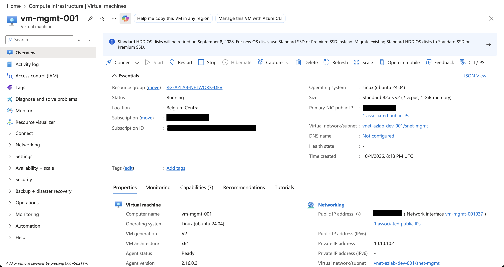

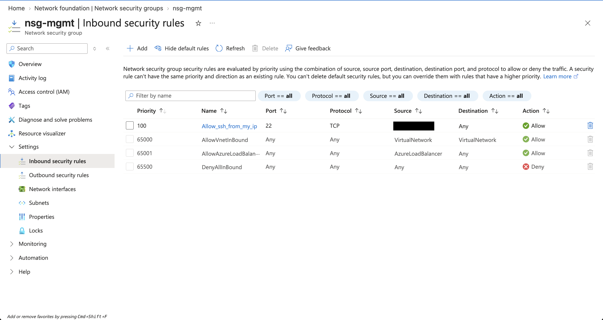

---

# Phase 4 — SSH Validation and Authentication Troubleshooting

My first SSH attempt reached the VM but failed with:

```text
Permission denied (publickey)
```

The cause was not Azure networking. I used the wrong Linux username.

Incorrect:

```bash
ssh -i ~/.ssh/key.pem user@<public-ip>
```

Correct:

```bash
ssh -i ~/.ssh/key.pem azureuser@<public-ip>
```

This was an important troubleshooting distinction:

| Symptom | Likely area |
|---|---|
| `Permission denied (publickey)` | SSH authentication / username / key |
| Connection timeout | NSG, route, reachability, VM state |
| Connection refused | Host reachable but service not listening / local firewall |

After correcting the username, SSH succeeded.

Validation commands:

```bash
hostname
ip addr
ip route
```

Observed on `vm-mgmt-001`:

- Hostname: `vm-mgmt-001`
- Private IP: `10.10.10.4/24`
- Default route through Azure virtual networking

### Evidence — Management VM network validation

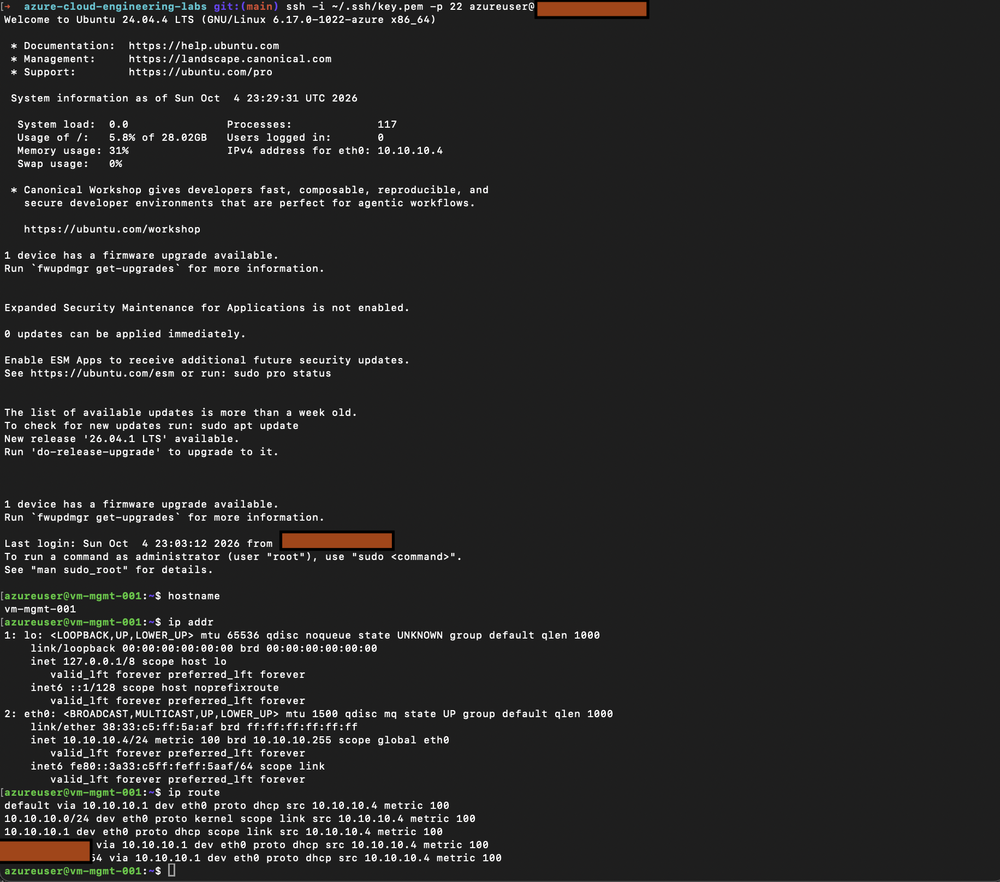

---

# Phase 5 — Private Application VM

`vm-app-001` was deployed in `snet-app`.

Configuration:

- Ubuntu Server 24.04 LTS
- B-series VM
- Private IP: `10.10.20.4`
- **No public IP**
- Public inbound ports: **None**
- NIC NSG: **None**
- Security enforced through `nsg-app`

This VM cannot be administered directly from the internet.

The management VM acts as the jump host.

### Evidence — Private application VM

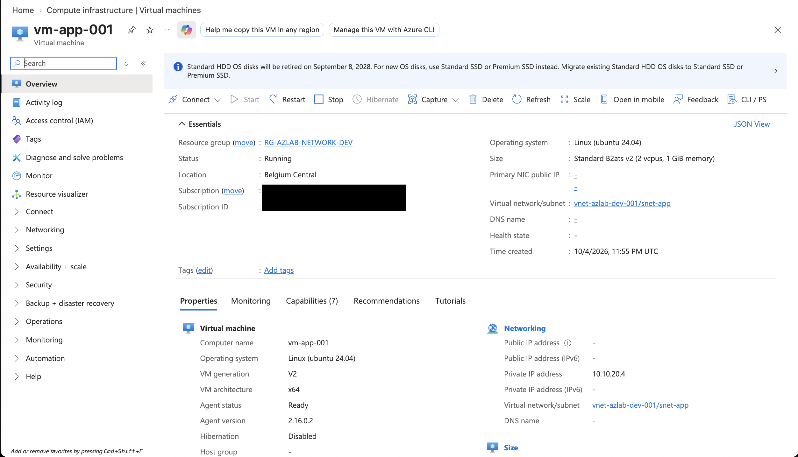

---

## SSH ProxyJump

The private key remains on my local machine. It is not copied to the management VM.

Example local SSH configuration:

```text
Host azure-mgmt
    HostName <mgmt-public-ip>
    User azureuser
    IdentityFile ~/.ssh/key.pem
    IdentitiesOnly yes

Host azure-app
    HostName 10.10.20.4
    User azureuser
    IdentityFile ~/.ssh/key.pem
    IdentitiesOnly yes
    ProxyJump azure-mgmt
```

Connection:

```bash
ssh azure-app
```

The private application VM became reachable through the jump host.

Validation on `vm-app-001`:

```bash
hostname
ip addr
ip route
who
echo $SSH_CONNECTION
```

The SSH connection information confirmed that the session reaching the application VM originated from:

```text
10.10.10.4 -> 10.10.20.4:22
```

This proves the management path is using private Azure networking after the initial connection to the jump host.

### Evidence — Private connectivity through ProxyJump

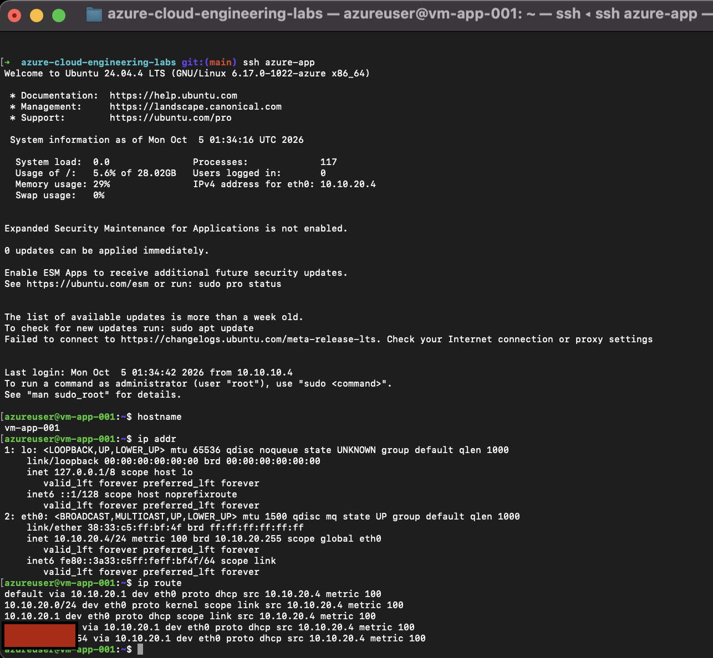

---

# Phase 6 — Intentional NSG Failure

To test NSG rule evaluation, I created a custom inbound deny rule on `nsg-app`:

```text
Priority: 200
Source: 10.10.10.0/24
Protocol: TCP
Destination port: 22
Action: Deny
Name: Deny-SSH-From-Mgmt-Subnet
```

Because priority 200 is evaluated before the default `AllowVNetInBound` rule at priority 65000, SSH traffic from the management subnet was dropped.

Retesting:

```bash
ssh azure-app
```

The SSH session no longer completed and had to be interrupted.

This demonstrates that the failure was caused by network policy rather than SSH authentication.

### Evidence — Intentional failure

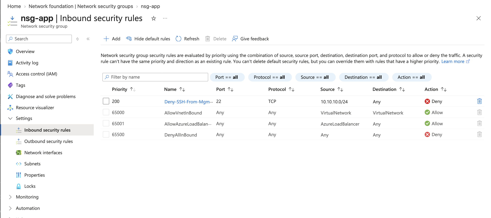

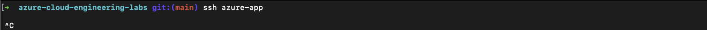

---

# Phase 7 — Restore Access with Least Privilege

The intended final policy is:

```text
100   Allow 10.10.10.4/32  -> TCP/22
200   Deny  10.10.10.0/24  -> TCP/22
65000 AllowVNetInBound
65500 DenyAllInBound
```

This allows SSH only from the designated management VM while denying SSH from other hosts in the management subnet.

The priority-100 rule was finally tightened to `10.10.10.4/32`, so only the designated management VM can initiate SSH to the application VM.

After the allow rule was introduced, SSH connectivity to `vm-app-001` was restored. The connection details confirmed the source was `10.10.10.4`.

### Evidence — Access restored and least privilege enforced

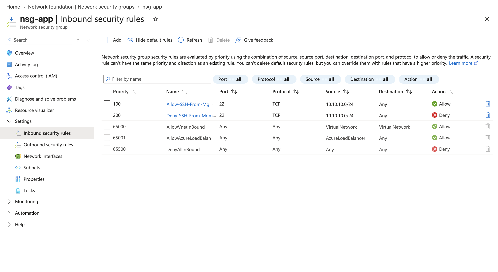

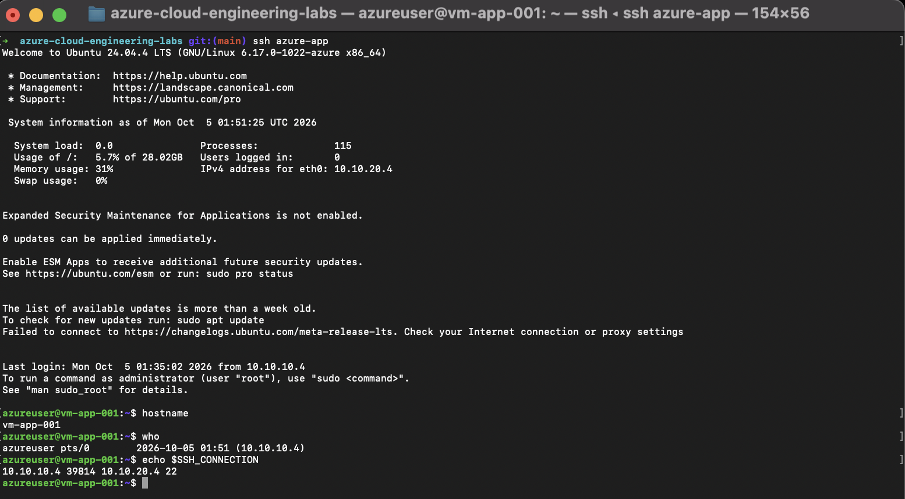

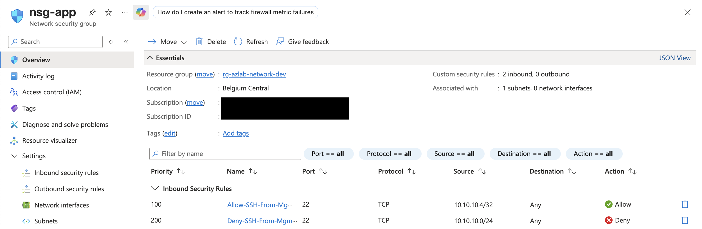

---

# Phase 8 — Explicit Outbound Connectivity with NAT Gateway

The private application VM initially had working DNS resolution and an active default route to the Internet, but outbound HTTPS connections timed out.

Observed baseline:

```text
DNS resolution                       ✅
0.0.0.0/0 -> Internet system route  ✅
Outbound HTTPS                       ❌
```

This showed that routing existed, but the private VM did not yet have a usable explicit outbound SNAT path.

### Evidence — Outbound failure and effective routes

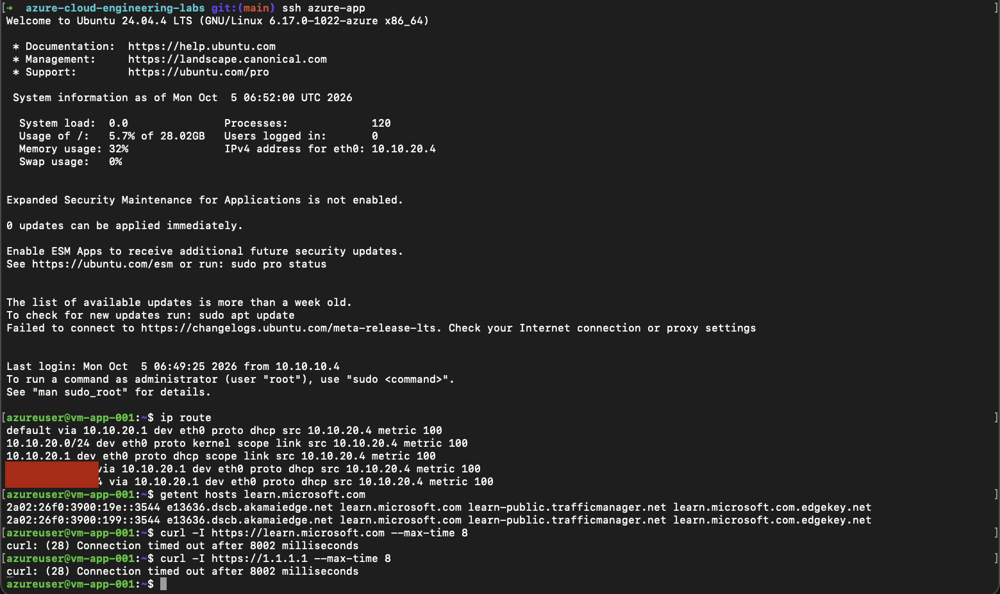

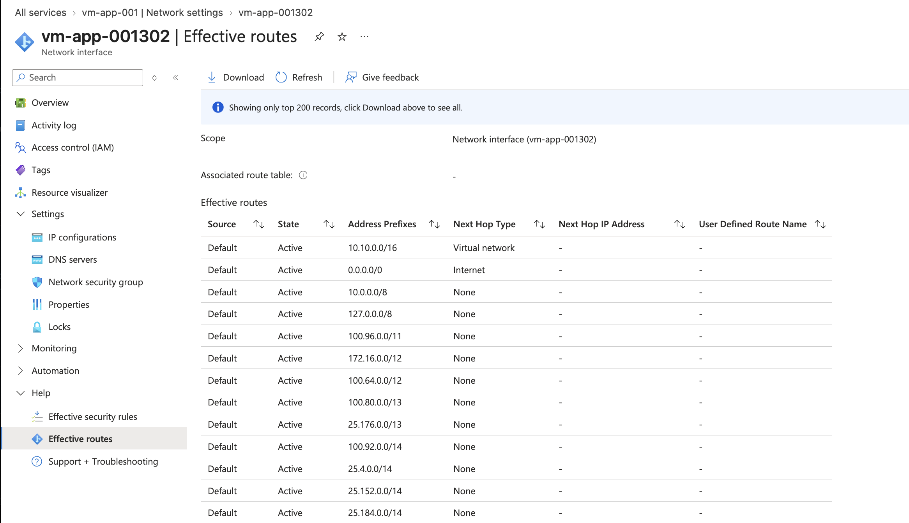

A NAT Gateway was then deployed and associated only with `snet-app`:

```text
nat-azlab-app
└── snet-app 10.10.20.0/24
    └── vm-app-001 10.10.20.4
```

The VM remained private-only with no public IP on its NIC.

After the NAT Gateway was associated, HTTPS and package repository access worked:

```bash
curl -I https://learn.microsoft.com --max-time 8
sudo apt update
```

The NAT public IP was also validated from the VM with:

```bash
curl https://api.ipify.org
```

The returned public address matched the public IP assigned to the NAT Gateway, proving outbound SNAT.

### Evidence — NAT Gateway and SNAT validation

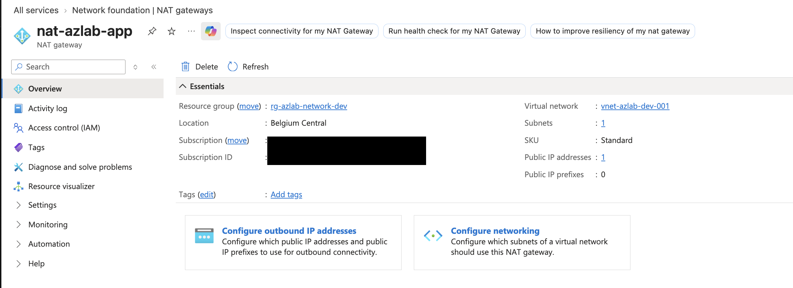

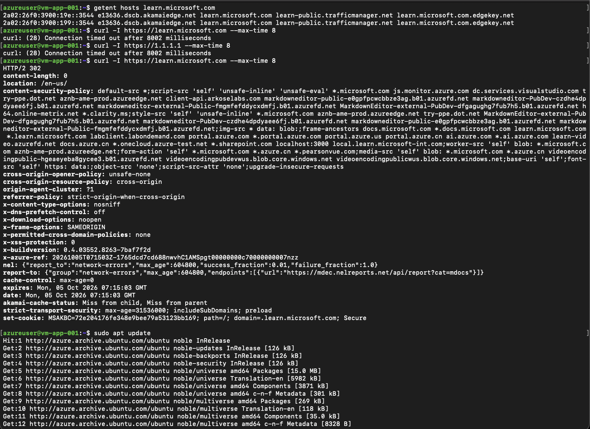

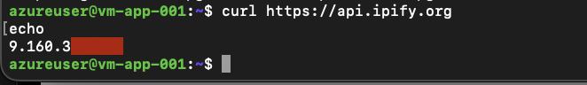

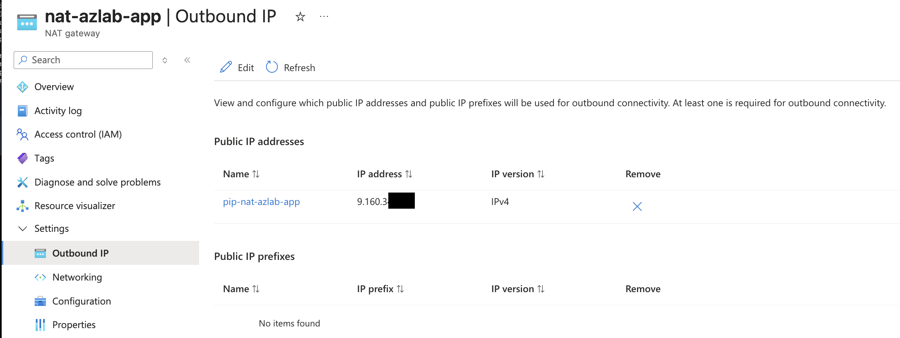

---

# Phase 9 — User Defined Route Failure and Recovery

A route table named `rt-app` was associated with `snet-app`.

To test route precedence, a temporary blackhole route was created:

```text
Name: block-internet
Prefix: 0.0.0.0/0
Next hop: None
```

This user-defined route overrode the default Internet path and intentionally dropped outbound traffic.

### Evidence — UDR blackhole

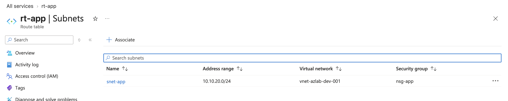

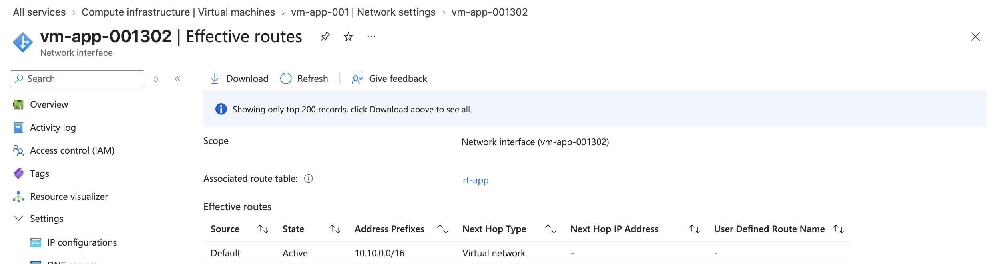

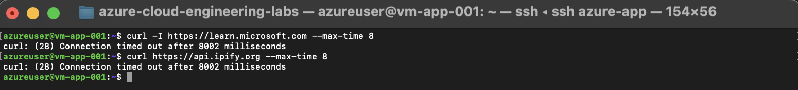

After deleting only the `block-internet` route, Azure returned to the default active route:

```text
0.0.0.0/0 -> Internet
```

The empty route table remained associated with the subnet but no longer overrode the Azure system route. Outbound HTTPS worked again through the NAT Gateway.

### Evidence — Routing recovery

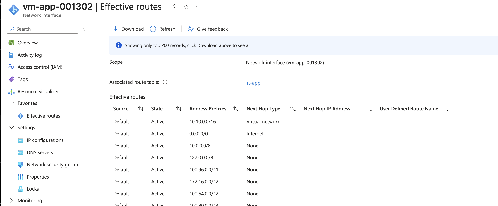

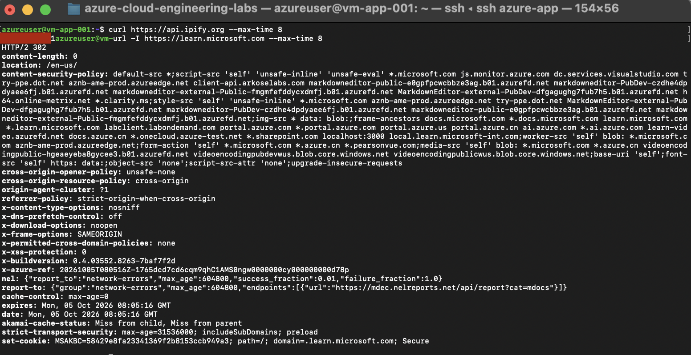

This experiment demonstrated that the route table itself was not the cause of the outage; the specific `0.0.0.0/0 -> None` UDR was.

---

# Security Decisions

## DDoS protection

Advanced DDoS protection was reviewed but not enabled for this learning lab.

Reason:

- Azure already provides baseline infrastructure-level DDoS protection
- Advanced protection would add cost
- Generating attack traffic is not an appropriate validation method for this lab

## Bastion

Azure Bastion was reviewed but not deployed in this first lab because the goal was to understand the underlying public-IP, NSG, SSH, and jump-host behavior directly.

A future lab can compare this design with Bastion-based private administration.

## Public IP exposure

Only the management VM has temporary public addressing.

The application VM is private-only.

## SSH keys

- SSH public-key authentication is used
- Private keys remain on the local workstation
- Private keys are never committed to GitHub
- ProxyJump is used instead of copying private keys to the jump host

---

# Troubleshooting Lessons

## 1. Public IP is not the same as an open port

A VM can have a public IP while an NSG blocks all inbound traffic.

```text
Public IP = addressing / reachability
NSG       = allow / deny policy
```

## 2. Authentication failure vs network failure

`Permission denied (publickey)` showed that TCP/22 was reachable and the SSH server answered.

An SSH timeout after the NSG deny rule showed that traffic was being dropped before authentication.

## 3. Azure routes between subnets automatically

Both subnets are inside the same VNet, so Azure provides system routes between them by default.

Custom NSG rules were required to restrict the traffic.

## 4. Security rule priority matters

Lower numbers are evaluated first.

A custom priority-200 deny overrides the default priority-65000 VNet allow.

## 5. Private-only workloads can still be administered securely

The application VM does not need a public IP. It can be reached through a controlled management path.

## 6. A default Internet route does not guarantee usable outbound connectivity

The application VM had an active `0.0.0.0/0 -> Internet` route and working DNS, but HTTPS still timed out until an explicit outbound NAT path was added.

## 7. NAT Gateway provides outbound identity without making the VM public

The VM remained private-only while outbound connections were translated through the NAT Gateway public IP.

## 8. A UDR can intentionally override Azure system routing

The temporary `0.0.0.0/0 -> None` route blackholed outbound traffic. Removing that route restored the Azure system route and NAT-based outbound connectivity.

---

# Evidence Captured

The following screenshots were captured during the lab and should be published only after sensitive values are redacted:

| Evidence | Purpose |
|---|---|
| `01-vnet-overview-redacted.png` | VNet overview |
| `02-subnets-baseline.png` | Baseline subnet configuration |
| `03-subnets-with-nsgs.png` | Two subnets with subnet-level NSGs |
| `04-nertwork-sec-groups.png` | NSG resources |
| `05-vm-mgmt-001.png` | Management VM configuration |
| `06-nsg-restricted-ssh.png` | SSH restricted to my source IP |
| `07-vm-mgmt-network-validation.png` | Management VM SSH and routes |
| `08-vm-app-001.png` | App VM with no public IP |
| `09-vm-app-network-validation.png` | Private jump-host connectivity |
| `10-nsg-app-deny-ssh.png` | Intentional deny rule |
| `11-ssh-blocked-by-nsg.png` | Failed SSH test |
| `12-ssh-restored-after-allow-rule.png` | Connectivity restored |
| `13-nsg-app-controlled-ssh.png` | Intermediate controlled allow + deny policy |
| `14-vm-app-outbound-failure.png` | DNS works but outbound HTTPS fails |
| `15-vm-app-effective-routes.png` | Default system routes before NAT |
| `16-nat-gateway-app-subnet.png` | NAT Gateway associated with app subnet |
| `17-vm-app-outbound-restored.png` | HTTPS and package access restored |
| `18-vm-app-nat-public-ip-validation.png` | Public IP observed from private VM |
| `19-nat-gateway-outbound-ip.png` | NAT Gateway outbound public IP |
| `20-route-table-associated.png` | Route table associated with app subnet |
| `21-udr-blackhole-effective-route.png` | Blackhole UDR in effective routing |
| `22-udr-outbound-blocked.png` | Outbound traffic blocked by UDR |
| `23-effective-routes-restored.png` | Default route restored after UDR removal |
| `24-outbound-restored-after-udr-removal.png` | Outbound connectivity restored |
| `25-nsg-app-final-least-privilege.png` | Final /32 SSH allow policy |

Sensitive information to redact before publishing:

- Subscription IDs
- Public IP addresses
- Personal source IP addresses
- Account email addresses
- Any private-key material

Private RFC1918 addresses used inside the lab are intentionally visible because they are part of the network design.

---

# Current Lab Status

Completed:

- ✅ Resource group
- ✅ VNet and subnet segmentation
- ✅ Subnet-level NSGs
- ✅ Management VM
- ✅ Restricted inbound SSH to management VM
- ✅ Private-only application VM
- ✅ SSH ProxyJump
- ✅ Inter-subnet validation
- ✅ Intentional NSG deny test
- ✅ Troubleshooting and access restoration

Completed technical work:

- ✅ Final least-privilege SSH rule: `10.10.10.4/32`
- ✅ Explicit outbound connectivity through NAT Gateway
- ✅ NAT/SNAT public-IP validation
- ✅ Route table association
- ✅ Intentional UDR blackhole
- ✅ Effective-route troubleshooting
- ✅ Routing recovery after UDR removal

Cleanup completed:

- ✅ Lab VMs and compute resources removed
- ✅ NAT Gateway and outbound public IP removed
- ✅ Disposable networking resources cleaned up
- ✅ No Lab 01 infrastructure intentionally left running

The screenshots and documentation remain as the reproducible evidence for the completed lab.
