# Lab 02 — Secure Azure Storage Access

> Status: 🟡 **Technical work complete — cleanup pending**  
> Region: **Belgium Central**

This lab focuses on securing Azure Blob Storage from a cloud infrastructure and networking perspective.

The objective was to allow a Linux workload to access a private Blob container without exposing the storage account to the public network, using **Azure Private Endpoint, Private DNS, Managed Identity, and Azure RBAC**.

---

## What This Lab Demonstrates

- VNet and subnet segmentation
- Restricted SSH administration
- Azure Storage with public network access disabled
- Blob Private Endpoint
- Azure Private DNS for Private Link
- DNS-to-private-IP validation
- TCP/HTTPS validation to Azure Storage
- System-assigned Managed Identity
- Azure RBAC data-plane authorization
- Blob list, upload, and download operations
- Intentional DNS failure
- Failure isolation and recovery
- Cost-aware cleanup

---

## Final Architecture

```text
Administrator workstation
        |
        | SSH/22 restricted by NSG
        v
+---------------------------+
| vm-storage-client         |
| 10.10.10.4                |
| system-assigned identity  |
+-------------+-------------+
              |
        snet-client
       10.10.10.0/24
              |
              | normal storage FQDN
              v
   Azure Private DNS
privatelink.blob.core.windows.net
              |
              | A record
              v
          10.10.20.4
              |
        Private Endpoint
      prv-endp-blob-001
              |
   snet-priv-endpoint
       10.10.20.0/24
              |
              v
      Azure Blob Storage
 storageaccountlabdev001

Public network access: DISABLED
Anonymous blob access: DISABLED

Authorization path:
vm-storage-client Managed Identity
              |
              v
Microsoft Entra ID
              |
              v
Storage Blob Data Contributor
              |
              v
Azure Blob Storage
```

The design separates two different security questions:

```text
Private Endpoint + Private DNS
= How does the workload reach Storage privately?

Managed Identity + RBAC
= Is the workload allowed to use the Blob service?
```

---

## Resources

| Resource | Configuration |
|---|---|
| Resource group | `rg-azlab-storage-dev` |
| Virtual network | `vnet-azlab-dev-001` |
| Client subnet | `snet-client` — `10.10.10.0/24` |
| Private Endpoint subnet | `snet-priv-endpoint` — `10.10.20.0/24` |
| Linux client | `vm-storage-client` — `10.10.10.4` |
| Client NSG | `nsg-lab-001` |
| Storage account | `storageaccountlabdev001` |
| Blob container | `blob-lab-001` |
| Private Endpoint | `prv-endp-blob-001` — `10.10.20.4` |
| Private DNS zone | `privatelink.blob.core.windows.net` |
| VM identity | System-assigned Managed Identity |
| Blob role | `Storage Blob Data Contributor` |

---

# Phase 1 — Network Foundation

The VNet was segmented into a workload subnet and a separate subnet for the Private Endpoint.


This provides a clear separation between the client workload and the private service endpoint.

---

# Phase 2 — Storage Baseline

A general-purpose v2 storage account and private Blob container were created.

The Blob container was configured as private, and anonymous blob access was disabled.

Evidence captured:

- `2.storage-account-details.png`
- `3.blob-storage.png`

The lab then moved away from the public storage path entirely.

---

# Phase 3 — Disable Public Storage Network Access

Public network access on the storage account was disabled.

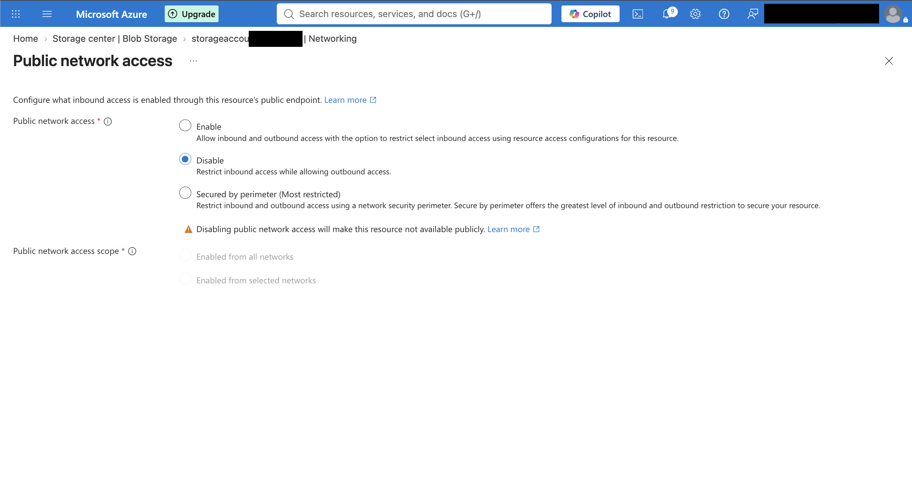

This means the normal public network path cannot be used to access the storage account. A private network path is therefore required.

---

# Phase 4 — Private Endpoint

A Blob Private Endpoint was created in `snet-priv-endpoint`.

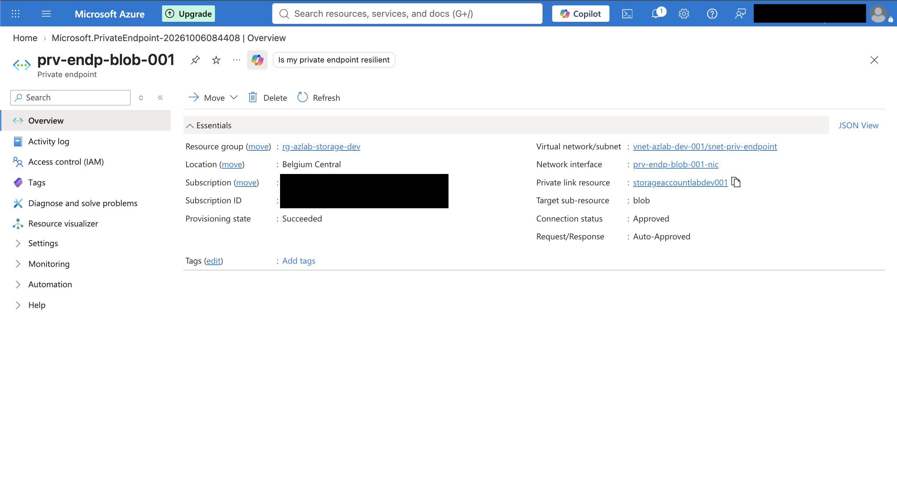

The endpoint received private IP:

```text
10.10.20.4
```

The connection state was approved and the target sub-resource was `blob`.

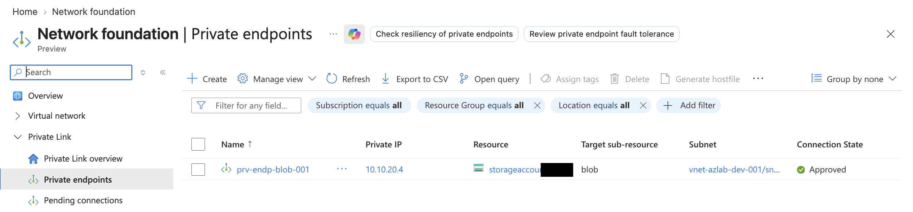

A key lesson:

> A Private Endpoint gives the Azure service a private IP presence inside the VNet. It does not by itself make applications use that private IP.

DNS is required to connect the normal service hostname to that private address.

---

# Phase 5 — Secure Client Administration

The Linux client VM was placed in `snet-client`.

Inbound SSH was restricted with an NSG rule to the administrator source IP.

Evidence:

- `6.allow-ssh-to-vm-client.png`
- `7.ssh-connection-validation.png`

The VM used private address:

```text
10.10.10.4
```

---

# Phase 6 — Private DNS Validation

Azure Storage applications normally connect to:

```text
<storage-account>.blob.core.windows.net
```

The Private DNS configuration changed the resolution path inside the VNet:

```text
storageaccountlabdev001.blob.core.windows.net
                    |
                    | CNAME
                    v
storageaccountlabdev001.privatelink.blob.core.windows.net
                    |
                    | A
                    v
                10.10.20.4
```

This was validated from `vm-storage-client` using `getent` and `nslookup`.

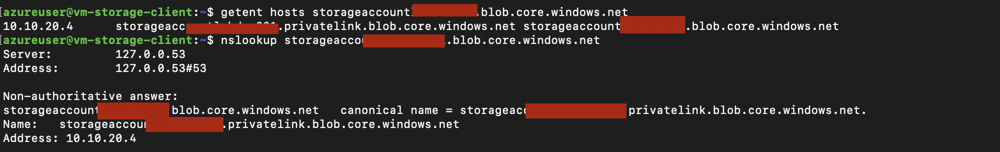

The resolved address matched the Private Endpoint IP exactly.

---

# Phase 7 — Network and HTTPS Validation

TCP/443 to the normal storage FQDN succeeded and resolved to `10.10.20.4`.

An HTTPS request returned an Azure Storage HTTP response.

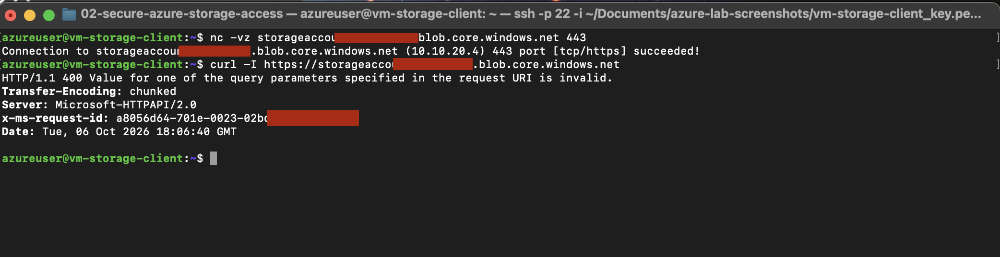

The HTTP `400` response was useful evidence:

```text
DNS                         ✅
Private routing             ✅
TCP/443                     ✅
TLS/HTTPS                   ✅
Azure Storage responded     ✅
Valid Blob API request      ❌
```

This distinguished connectivity from application-level request formatting or authorization.

---

# Phase 8 — Managed Identity and RBAC

A system-assigned Managed Identity was enabled on `vm-storage-client`.


The identity was then granted the data-plane role:

```text
Storage Blob Data Contributor
```

at the storage-account scope.

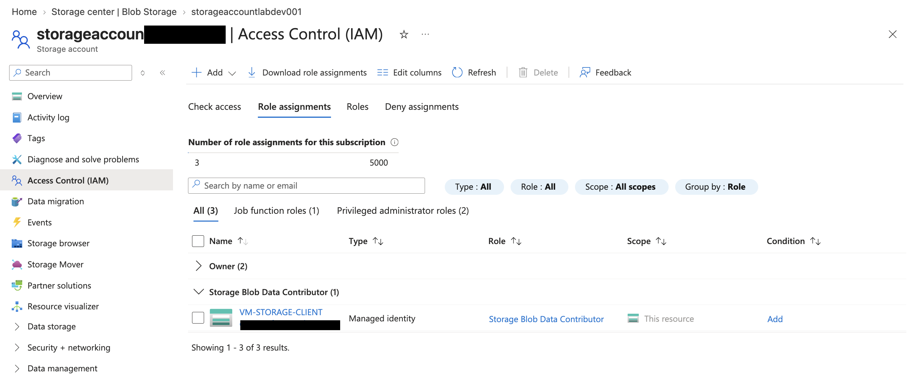

This is different from management-plane roles such as `Storage Account Contributor`.

The VM needed permission to access **blob data**, not merely permission to manage the Azure Storage resource.

Azure CLI was installed on the VM and the workload authenticated without a stored password, secret, or storage account key:

```bash
az login --identity
```

Evidence:

- `13.Azure-CLI-installation.png`
- `14.access-to-blob-check.png`

---

# Phase 9 — Private Blob Operations

The VM used its Managed Identity and `--auth-mode login` to access the private Blob container.

The following operations were validated:

```text
List blobs       ✅
Upload blob      ✅
Download blob    ✅
Verify content   ✅
```

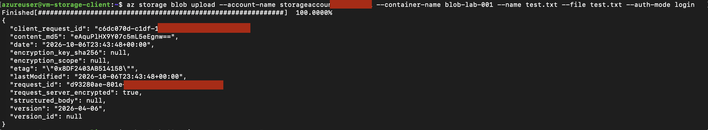

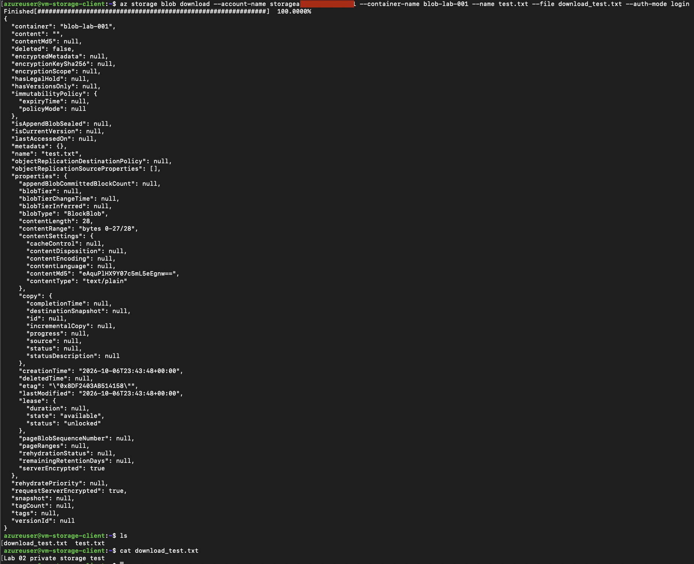

This proved the complete secure path:

```text
vm-storage-client
        |
        | Managed Identity / Entra ID / RBAC
        |
        | Storage FQDN
        v
Private DNS
        |
        v
10.10.20.4
        |
        v
Private Endpoint
        |
        v
Private Blob Container
```

No storage account key was required.

---

# Phase 10 — Intentional Private DNS Failure

To test dependency isolation, the private IP value was temporarily removed from the storage account A record in:

```text
privatelink.blob.core.windows.net
```

Evidence:

- `17.remove-ip-resolve.png`

After this change, the public storage hostname still returned the `privatelink` CNAME, but there was no A record mapping that private-link hostname to `10.10.20.4`.

At the same time, direct TCP connectivity to the Private Endpoint remained healthy:

```text
nc -vz 10.10.20.4 443
→ succeeded
```

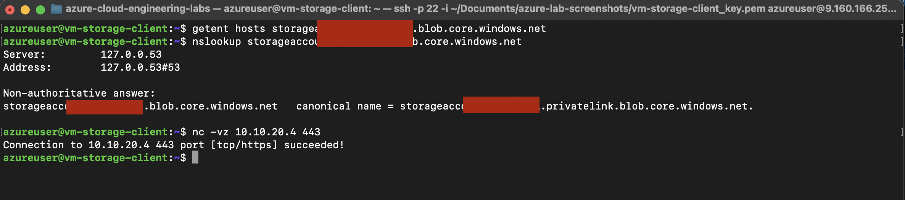

Blob access using the normal storage hostname no longer completed successfully.

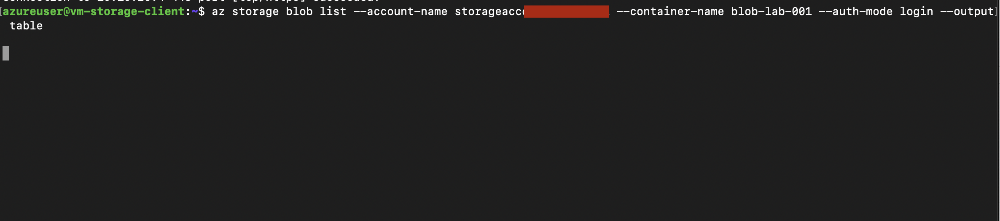

This isolated the fault:

```text
Private Endpoint                ✅
Private IP                      ✅
TCP/443 to Private Endpoint     ✅
Managed Identity / RBAC         unchanged
Private DNS A record            ❌
Application access by FQDN      ❌
```

The failure was DNS discovery, not routing, Private Endpoint health, or authorization.

---

# Phase 11 — DNS Recovery

The A record was restored:

```text
storageaccountlabdev001
    → 10.10.20.4
```

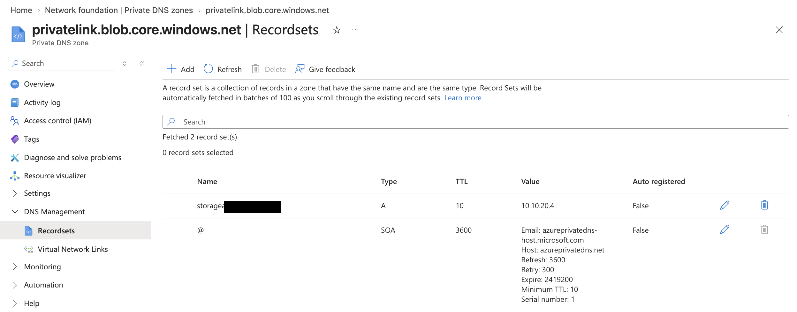

The VM again resolved the normal storage FQDN to the Private Endpoint address, and Blob listing immediately worked again.

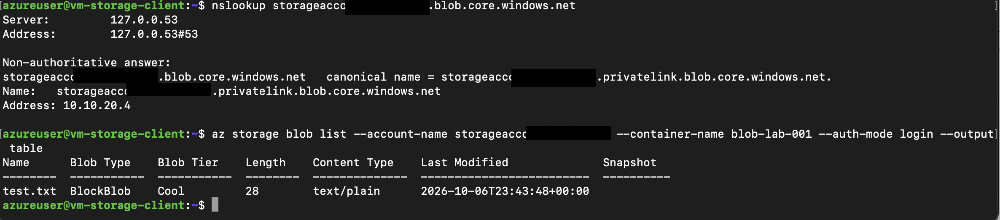

No Private Endpoint, NSG, VM, or RBAC change was required to restore service.

---

# Troubleshooting Conclusions

## Private Endpoint vs Private DNS

The Private Endpoint provides a private destination IP.

Private DNS makes the normal Azure service hostname resolve to that destination.

Without correct Private DNS, the endpoint can remain completely healthy while applications fail to find it.

## Network access vs authorization

Two independent security layers were required:

```text
Network layer:
Private Endpoint + Private DNS

Identity layer:
Managed Identity + Azure RBAC
```

Successful network connectivity does not grant Blob permissions.

Successful RBAC does not provide a working private network path.

## Control plane vs data plane

The VM required:

```text
Storage Blob Data Contributor
```

because the workload needed to read and write Blob data.

A management role on the VM or storage resource would not automatically provide Blob data permissions.

## HTTP errors can be diagnostic

A response such as HTTP `400` or `403` can prove that DNS, TCP, TLS, and the remote service are reachable.

A timeout suggests a different class of problem.

---

# Security Decisions

- Blob anonymous access disabled
- Storage public network access disabled
- Private Endpoint used for Blob traffic
- Private DNS used for service discovery
- SSH restricted through NSG
- Managed Identity used instead of stored credentials
- Storage Blob Data Contributor used for data-plane access
- No storage account key embedded in scripts
- Private Endpoint and RBAC treated as separate security controls

---

# Evidence Index

| # | Screenshot | What it proves |
|---:|---|---|
| 1 | `1.vnet-and-snets .png` | VNet and subnet segmentation |
| 2 | `2.storage-account-details.png` | Storage account baseline |
| 3 | `3.blob-storage.png` | Private Blob container |
| 4 | `4.sa-inbount-restricted.png` | Public storage network access disabled |
| 5 | `5.pivate-endpoint-to-blob.png` | Blob Private Endpoint |
| 6 | `6.allow-ssh-to-vm-client.png` | Restricted SSH rule |
| 7 | `7.ssh-connection-validation.png` | Linux client access |
| 8 | `8.DNS-resolving-validation.png` | Private DNS resolution |
| 9 | `9.endpoint-prv-ip.png` | Private Endpoint IP `10.10.20.4` |
| 10 | `10.https-to-storage-validation.png` | TCP/HTTPS reaches Storage privately |
| 11 | `11.system-assigned managed identity.png` | VM Managed Identity enabled |
| 12 | `12.role-assignment.png` | Blob data RBAC assignment |
| 13 | `13.Azure-CLI-installation.png` | Azure CLI installed on client |
| 14 | `14.access-to-blob-check.png` | Managed Identity login and Blob list |
| 15 | `15.upload-to-blob.png` | Blob upload |
| 16 | `16.download-from-blob.png` | Blob download and content verification |
| 17 | `17.remove-ip-resolve.png` | DNS A record intentionally broken |
| 18 | `18.prove-dns-failure.png` | DNS failure with endpoint TCP still healthy |
| 19 | `19.access-to-blob-broken.png` | Application access failure |
| 20 | `20.dns-restored.png` | DNS A record restored |
| 21 | `21.dns-validation.png` | DNS and Blob access recovery |

---

# Current Lab Status

Technical validation:

- ✅ VNet and subnet segmentation
- ✅ Restricted client administration
- ✅ Storage account and private Blob container
- ✅ Public storage network access disabled
- ✅ Private Endpoint
- ✅ Private DNS
- ✅ Private-IP DNS resolution
- ✅ TCP/HTTPS validation
- ✅ System-assigned Managed Identity
- ✅ Storage Blob Data Contributor
- ✅ Private Blob list/upload/download
- ✅ Intentional DNS failure
- ✅ Root-cause isolation
- ✅ DNS restoration and service recovery

Remaining:

- ⬜ Review/redact screenshots for public portfolio
- ⬜ Delete/deallocate disposable Azure resources
- ⬜ Confirm no Lab 02 billable resources remain active

---

# Key Takeaway

The main lesson from this lab is that secure Azure service access is not a single feature.

A private workload needed all of the following to work together:

**Private networking + DNS + identity + authorization**

The troubleshooting exercise also showed why testing each layer independently is important: the Private Endpoint remained reachable even while the application failed because DNS was broken.
