# Lab 03 — Azure Identity & RBAC: Least Privilege Access

> Status: 🟡 **Technical validation complete — cleanup pending**  
> Region: **Belgium Central**

This lab demonstrates Azure identity and authorization using **user-assigned managed identities**, **Azure RBAC**, and **least-privilege access**.

The main objective was to prove that Azure permissions depend on both the **role** and the **scope**, and to clearly separate:

- Authentication from authorization
- Read permissions from write permissions
- Control-plane access from data-plane access
- Network connectivity from identity permissions

The lab also kept Blob Storage on a private network path using **Private Endpoint + Private DNS**.

---

## What This Lab Demonstrates

- User-assigned managed identities
- Azure RBAC at storage-account scope
- `Storage Blob Data Reader`
- `Storage Blob Data Contributor`
- Built-in Azure `Reader`
- Least-privilege access
- Successful Blob read/list operations
- Intentional Blob write denial
- Successful operator upload
- Control-plane vs data-plane authorization
- Explicit managed-identity selection with Azure CLI
- Private Endpoint and Private DNS
- Troubleshooting authorization failures

---

## Architecture

```text
Administrator workstation
        |
        | SSH/22 restricted by NSG
        v
+--------------------------+
| vm-client                |
| snet-client              |
+-------------+------------+
              |
              | user-assigned managed identity
              |
       +------+-----------------------------+
       |                    |               |
       v                    v               v
 Reader-Identity      Operator-Identity   azure-reader
       |                    |               |
       |                    |               |
Storage Blob Data     Storage Blob Data    Reader
Reader                Contributor          (control plane)
       |                    |               |
       +---------+----------+               |
                 |                          |
                 v                          v
           Storage Account <----------------+
                 |
                 | Blob data plane
                 v
             blob-dev-002
                 |
                 | private access
                 v
        Private Endpoint
            10.10.20.4
                 |
        Private DNS zone
privatelink.blob.core.windows.net
```

The RBAC design intentionally gives each identity only the permissions required for its job.

---

## Resources

| Resource | Configuration |
|---|---|
| Resource group | `rg-azlab-identity-dev` |
| Virtual network | `vnet-azlab-dev-002` |
| Client subnet | `snet-client` — `10.10.10.0/24` |
| Storage / Private Endpoint subnet | `snet-storage` — `10.10.20.0/24` |
| Client VM | `vm-client` — Ubuntu 24.04 |
| Network security group | `nsg-lab-002` |
| Blob container | `blob-dev-002` |
| Private Endpoint | `prv-end-blob-stotage` |
| Private Endpoint IP | `10.10.20.4` |
| Private DNS zone | `privatelink.blob.core.windows.net` |
| Read identity | `Reader-Identity` |
| Operator identity | `Operator-Identity` |
| Control-plane test identity | `azure-reader` |

The storage-account name is intentionally represented as `<storage-account>` in the documentation.

---

# Phase 1 — Managed Identities

Two user-assigned managed identities were created for the data-plane tests:

- `Reader-Identity`
- `Operator-Identity`

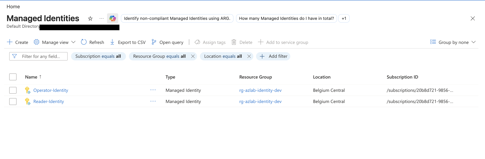

User-assigned identities were chosen so that the same VM could be tested with different permission sets without storing credentials.

---

# Phase 2 — Storage and Private Container

A StorageV2 account was created in the lab resource group.

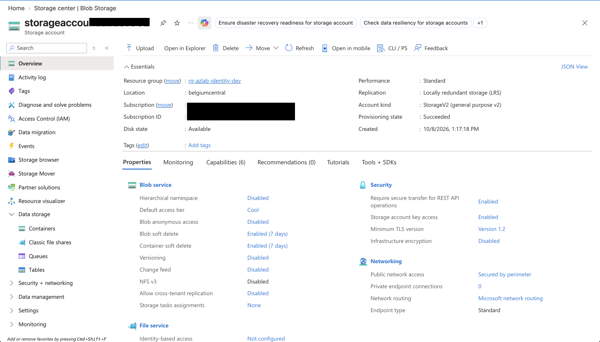

The Blob container used for authorization testing was:

```text
blob-dev-002
```

with anonymous access disabled.

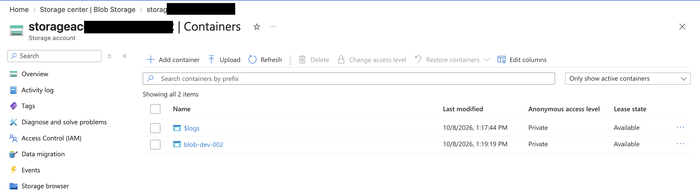

---

# Phase 3 — RBAC Design

The two data-plane roles were assigned at the storage-account scope.

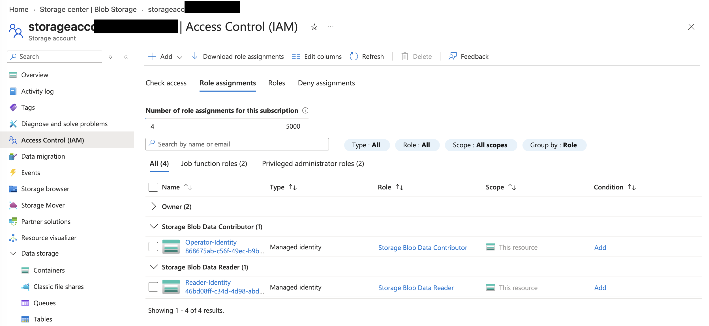

The intended permission model was:

| Identity | Role | Expected Blob behavior |
|---|---|---|
| `Reader-Identity` | `Storage Blob Data Reader` | List/read allowed, write denied |
| `Operator-Identity` | `Storage Blob Data Contributor` | List/read/write allowed |

This implements a practical least-privilege model:

```text
Reader workload
    → only read Blob data

Operator workload
    → read and modify Blob data
```

---

# Phase 4 — Network Foundation

The VNet was segmented into:

```text
snet-client   10.10.10.0/24
snet-storage  10.10.20.0/24
```


A Linux VM named `vm-client` was deployed in the client subnet.

The NSG allowed SSH only from the administrator source IP.

Network evidence is retained in:

- `6.client-vm.png`
- `7.nsg-allow-ssh-to-vm.png`

Sensitive subscription and public-IP values are not reproduced in this document.

---

# Phase 5 — Private Storage Path

A Blob Private Endpoint was created with private IP:

```text
10.10.20.4
```

and integrated with:

```text
privatelink.blob.core.windows.net
```

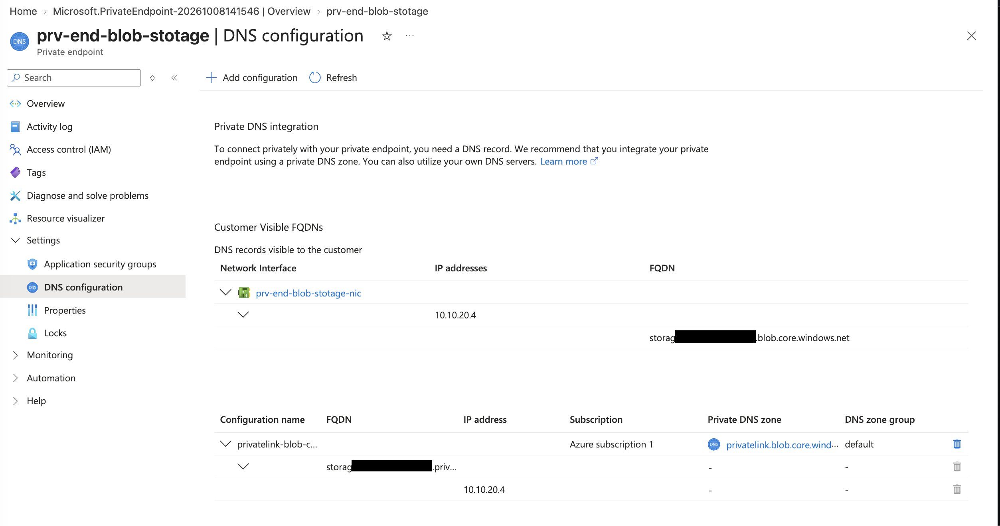

This means the storage network path and the authorization model can be evaluated separately:

```text
Private Endpoint + Private DNS
        = network path

Managed Identity + RBAC
        = authorization
```

---

# Phase 6 — Reader Identity Test

`Reader-Identity` was attached to `vm-client`.

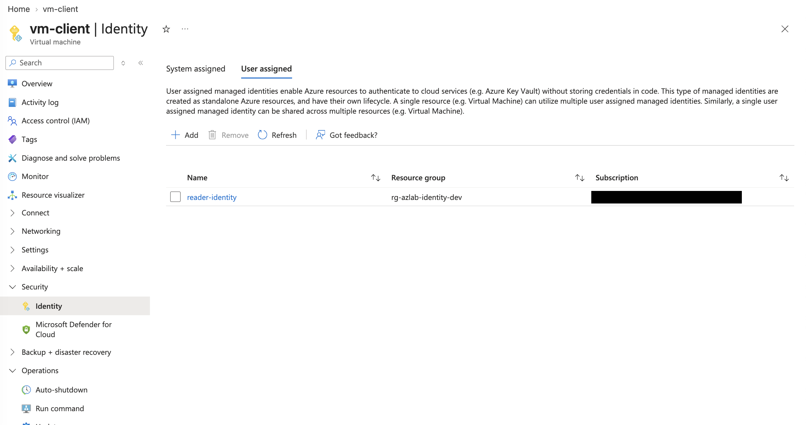

The VM authenticated with the managed identity and successfully listed Blob data in `blob-dev-002`.

The same identity then attempted to upload a new Blob to the same container.

The upload was denied.

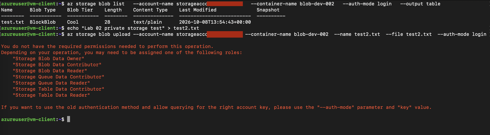

The result proves:

```text
Authentication                        ✅
Private storage connectivity          ✅
Blob list/read permission             ✅
Blob write permission                 ❌
```

The denied operation is expected behavior, not a failed lab.

It proves that `Storage Blob Data Reader` does not silently grant write permissions.

---

# Phase 7 — Operator Identity Test

The VM was then tested with `Operator-Identity`.

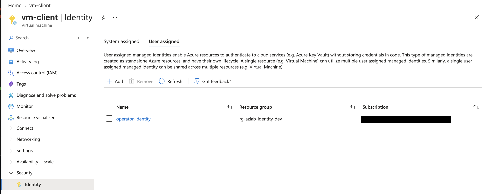

The identity had:

```text
Storage Blob Data Contributor
```

and the Blob upload succeeded.

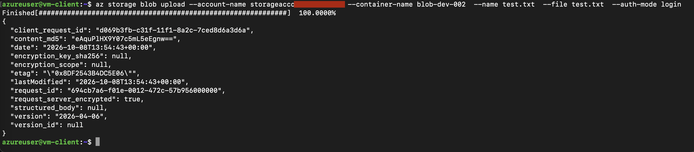

This creates a direct A/B comparison:

```text
Reader-Identity
    list/read   ✅
    upload      ❌

Operator-Identity
    list/read   ✅
    upload      ✅
```

---

# Phase 8 — Control Plane vs Data Plane

A third user-assigned managed identity, `azure-reader`, was assigned the built-in Azure role:

```text
Reader
```

at the storage-account scope.

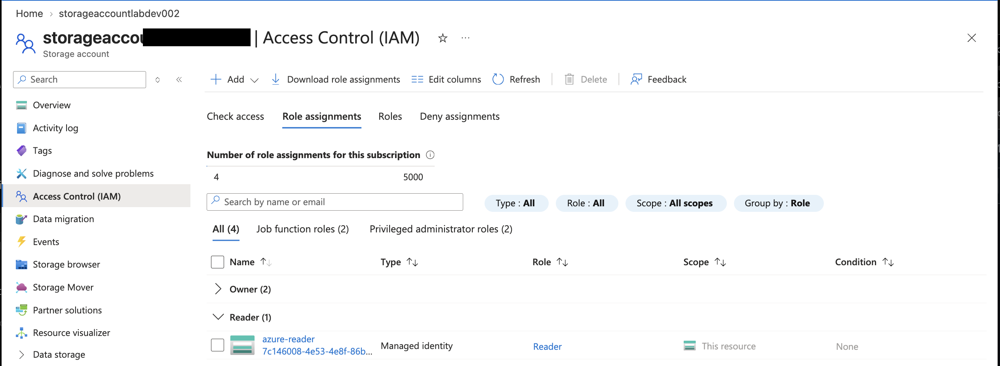

The identity was selected explicitly from the VM using its client ID.

Two commands were then compared.

### Control-plane request

```bash
az storage account show \
  --name <storage-account> \
  --resource-group rg-azlab-identity-dev \
  --output table
```

Result:

```text
SUCCESS
```

The identity could read the Azure resource configuration.

### Data-plane request

```bash
az storage blob list \
  --account-name <storage-account> \
  --container-name blob-dev-002 \
  --auth-mode login \
  --output table
```

Result:

```text
DENIED
```

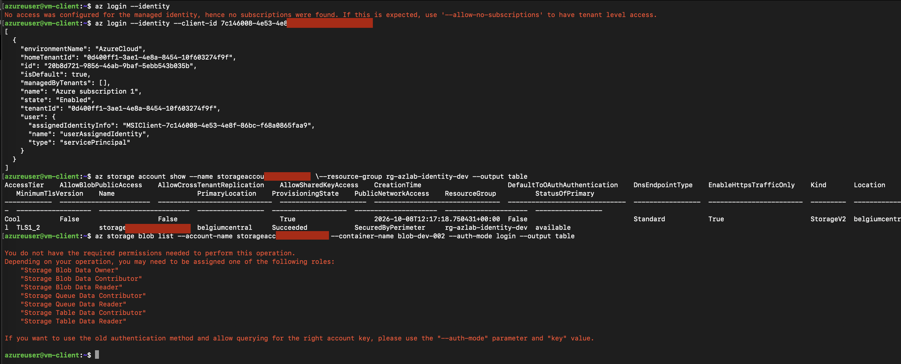

This is the key authorization result of the lab:

```text
Azure Reader
      |
      +--> Azure resource configuration     ✅
      |
      +--> Blob contents                    ❌
```

Therefore:

```text
Reader
    ≠
Storage Blob Data Reader
```

---

# Authentication vs Authorization

The lab also demonstrated that authentication and authorization are separate steps.

```text
Managed Identity
       |
       | proves identity
       v
Microsoft Entra ID
       |
       | RBAC evaluates permissions
       v
Requested Azure operation
```

A valid identity can authenticate successfully and still receive an authorization error when its role does not permit the requested operation.

---

# Role vs Scope

An Azure role assignment can be thought of as:

```text
Security principal
       +
Role definition
       +
Scope
       =
Effective Azure access
```

For this lab, the roles were assigned at the **storage-account scope**.

That means the identities receive their assigned permissions for the storage account rather than for the entire subscription.

A stricter production design could reduce data access further by assigning Blob data roles at individual container scope when appropriate.

---

# Control Plane vs Data Plane

This lab produced a practical distinction between two Azure permission models.

## Control plane

Controls management of the Azure resource itself.

Examples include:

- Reading storage-account configuration
- Viewing SKU and location
- Viewing networking configuration
- Managing Azure resource settings when the role permits it

The built-in `Reader` role demonstrated control-plane read access.

## Data plane

Controls access to the data inside a service.

For Blob Storage, examples include:

- Listing blobs
- Reading blobs
- Uploading blobs
- Deleting blobs

The `Storage Blob Data Reader` and `Storage Blob Data Contributor` roles demonstrated data-plane authorization.

---

# Troubleshooting Method

When a Blob operation returned a permission error, the investigation was separated into layers:

```text
1. Did managed-identity authentication succeed?
2. Is the intended identity selected?
3. Is private network connectivity working?
4. Which RBAC role is assigned?
5. At which scope?
6. Is the requested operation control-plane or data-plane?
```

This avoids changing networking when the actual problem is authorization.

See [troubleshooting.md](./troubleshooting.md) for the detailed failure analysis.

---

# Security Decisions

- User-assigned managed identities used instead of stored credentials
- Blob anonymous access disabled
- Private Endpoint used for storage traffic
- Private DNS integrated with the endpoint
- SSH restricted through an NSG
- Data Reader used for read-only workload
- Data Contributor used only where write access was required
- Built-in Reader used separately to prove control-plane behavior
- Storage account keys were not required for the RBAC tests
- Roles were not assigned at subscription scope

---

# Evidence Index

| # | Screenshot | Evidence |
|---:|---|---|
| 1 | `1.Managed-idetities.png` | Reader and Operator user-assigned identities |
| 2 | `2.storage-account.png` | Storage account configuration |
| 3 | `3.blob-container.png` | Private `blob-dev-002` container |
| 4 | `4.role-assignment.png` | Blob Data Reader and Contributor role assignments |
| 5 | `5.vnet and snets.png` | VNet and subnet segmentation |
| 6 | `6.client-vm.png` | Client Linux VM |
| 7 | `7.nsg-allow-ssh-to-vm.png` | Restricted SSH access |
| 8 | `8.private-endpoint-with-dns-zone.png` | Private Endpoint and Private DNS integration |
| 9 | `9.assign-reader-identity-to-vm.png` | Reader identity attached to VM |
| 10 | `10.access-failure-to-edit-blob.png` | Reader list succeeds and upload is denied |
| 11 | `11.assign-operator-identity.png` | Operator identity attached to VM |
| 12 | `12.access-blob-allowed.png` | Contributor upload succeeds |
| 13 | `13.reader-only-conf.png` | Built-in Reader assignment |
| 14 | `14.control-vs-data-plane-validation.png` | Control-plane success vs data-plane denial |

---

# Current Lab Status

Technical validation:

- ✅ User-assigned managed identities
- ✅ Storage account and private container
- ✅ Reader and Contributor Blob roles
- ✅ VNet and client VM
- ✅ Restricted SSH
- ✅ Private Endpoint and Private DNS
- ✅ Reader list/read behavior
- ✅ Reader write denial
- ✅ Operator write success
- ✅ Built-in Reader control-plane test
- ✅ Data-plane denial with control-plane Reader
- ✅ Authentication vs authorization demonstrated
- ✅ Control plane vs data plane demonstrated
- ✅ Documentation and evidence organized

Remaining:

- ⬜ Review screenshots for public identifiers before external sharing
- ⬜ Delete/deallocate disposable Lab 03 resources
- ⬜ Confirm no Lab 03 billable resources remain active

---

# Key Takeaways

The strongest lessons from this lab are:

1. **Authentication does not equal authorization.**
2. **A role is meaningful only together with its scope.**
3. **Least privilege can be proven through denied operations, not only successful ones.**
4. **Azure control-plane permissions do not automatically grant service data-plane permissions.**
5. **`Reader`, `Storage Blob Data Reader`, and `Storage Blob Data Contributor` solve different authorization problems.**
6. **Private networking and RBAC should be troubleshot as separate layers.**

The final mental model is:

```text
Who am I?
    → Managed Identity / Entra ID

What am I allowed to do?
    → Azure RBAC

Where does that permission apply?
    → Scope

How do I reach the service?
    → Private Endpoint + Private DNS
```
